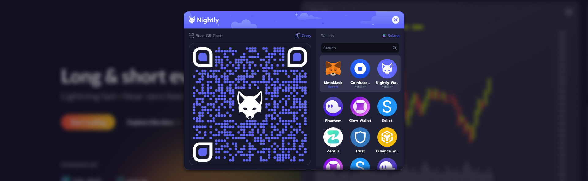

<head>
    <meta name="DC.title" content="Nightly Connect - your key to the metaverse" />
    <meta name="title"content="Nightly Connect - future is multichain" />
    <meta property="og:description" content="Nightly Connect - protocol which establishes a connection on chain between Nightly Mobile Wallet and dApp through scanning QR code on NEAR, Solana and Aptos." />
    <meta property="twitter:description" content="Nightly Connect - protocol which establishes a connection on chain between Nightly Mobile Wallet and dApp through scanning QR code on NEAR, Solana and Aptos." />
    <meta name="DC.description" content="Nightly Wallet - The fastest multichain wallet to manage your tokens and NFTs via an extension or mobile app. Your key to the metaverse available on NEAR, Solana and Aptos." />
</head>

### Nightly created to Connect ###

**Nightly Connect** is an easy and user friendly way to connect applications with client's wallet. Scan, connect and approve. In these few steps the application is connected to the wallet.

Secure way to communicate between wallets and dapps.
Nightly Connect can be easily adapted on any blockchain. Right now we are supporting wallets on Near and Solana.

### Get started

:::info
Simply integrate Nightly Connect to your application or wallet with our [Nightly Connect package](https://www.npmjs.com/package/@nightlylabs/connect).<br/>
Install with code below in your terminal to get started.

```bash
# Using NPM
npm install @nightlylabs/connect

# Using Yarn
yarn add @nightlylabs/connect
```

:::

Nightly Connect is a remote signer protocol which communicates securely between dapps and web3 wallets. The protocol establishes a remote pairing between two dapps and/or devices. Payloads are encrypted through a shared sessionId between the two sides. The connection is initiated by one peer displaying a QR Code and is established when the counter-party approves the request.

:::info
Please follow the links to take on live example implementation of Nightly Connect: [Near](https://github.com/near/wallet-selector/pull/337/files) and [Solana](https://github.com/Synthetify/synthetify-webapp/pull/381/files).<br/>
Link to [Near wallet-selector](https://github.com/near/wallet-selector).
:::
