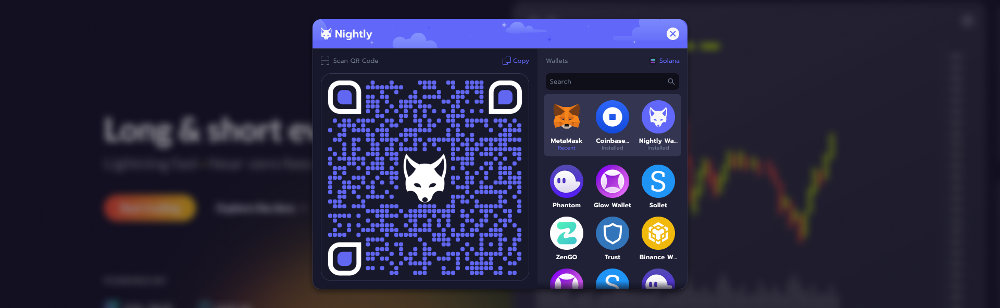

import Tabs from '@theme/Tabs';
import TabItem from '@theme/TabItem';



### Nightly created to Connect

**Nightly Connect** is a permissionless, open-source solution that serves as both a wallet adapter and a bridge wallet, enabling connections through QR codes or deep links.

We built this tool to lighten dApp developers in continuously adding new wallets. Now, after implementing Nightly Connect once, all standard-compliant wallets will be added automatically without any action required from dApp.

Our goal is to be compatible with every mobile wallet. Unfortunately, this requires minimal changes on the wallet's side. But it's worth it - after implementing these changes, any mobile application will be able to connect to any dApp through Nightly Connect using QR codes or deep links, and will gain access to tools such as push notifications.

### Get started

:::info
Install with code below in your terminal to get started.

<Tabs>
<TabItem value="Solana" label="Solana">

Simply integrate Nightly Connect to your application or wallet with our [Nightly Solana Connect package](https://www.npmjs.com/package/@nightlylabs/wallet-selector-solana).

```bash
# Using NPM
npm i @nightlylabs/wallet-selector-solana

# Using Yarn
yarn add @nightlylabs/wallet-selector-solana

```

</TabItem>
<TabItem value="SUI" label="SUI">

Simply integrate Nightly Connect to your application or wallet with our [Nightly Sui Connect package](https://www.npmjs.com/package/@nightlylabs/wallet-selector-sui).

```bash
# Using NPM
npm i @nightlylabs/wallet-selector-sui

# Using Yarn
yarn add @nightlylabs/wallet-selector-sui
```

</TabItem>

<TabItem value="Substrate" label="Substrate">

Simply integrate Nightly Connect to your application or wallet with our [Nightly Polkadot Connect package](https://www.npmjs.com/package/@nightlylabs/wallet-selector-polkadot).

```bash
# Using NPM
npm i @nightlylabs/wallet-selector-polkadot

# Using Yarn
yarn add @nightlylabs/wallet-selector-polkadot

```

</TabItem>
</Tabs>

:::
